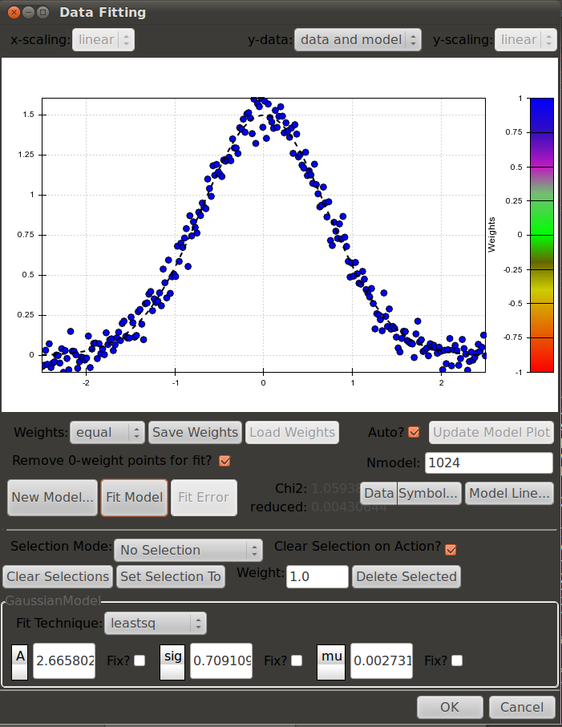

Overview and Tutorial
=====================

The :mod:`pymodelfit` module contains objects and functions for fitting
data to models as well as calculations and estimates from these models. The
available fitting algorithms are those from :mod:`scipy.optimize` or the `PyMC
<http://code.google.com/p/pymc/>`_ .

The aim of these classes are mostly for easily and quickly generating a range of
models. There are classes in :mod:`~pymodelfit.core` for various
dimensionalities, and helper classes to make it trivial to implement one of
these classes. For example, most models can be implemented as a subclass with
only a single additional function describing the model itself. Further, the
module includes a model registry to easily access the builtin models and any
others the user wishes to implement.

Module Organization
-------------------

The :mod:`pymodelfit` package is composed of two submodules that are both
imported into the main module. The first, :mod:`~pymodelfit.core` contains the
classes and functions that structure and do most of the work of the models. The
second, :mod:`~pymodelfit.builtins` contains a default set of models. There are
two additional modules that contain GUIs for interactive model-fitting. For
single 1D models, the :mod:`~pymodelfit.fitgui` module contains the gui, while
for a multi-variable fit, the :mod:`~pymodelfit.multifitgui` can fit multiple
simultaneous 1D relations and display them in 3D.

.. note::

    Everything in the :mod:`~pymodelfit.core` and :mod:`~pymodelfit.builtins`
    modules are present in the :mod:`pymodelfit` module, and hence can be
    accessed from there. For example, :class:`pymodelfit.core.FunctionModel` and
    :class:`pymodelfit.FunctionModel` are different names for the same class.
    The second form is recommended for consistency and brevity.
    

Tutorial/Examples
-----------------

The basic idea of pymodelfit is to use either a custom-defined model (see
example below), or one of the builtin models (in :mod:`~pymodelfit.builtins`) to
represent a model and its associated parameters, which can then be fit to a
supplied dataset, providing the best-fit parameters. While the default fitting
technique (the Levenberg-Marquardt algorithm) is fairly robust and standard,
`pymodelfit` provides a number of ways to customize fitting methods for a given
model, providing both power and flexibility.

`pymodelfit` can support different dimensionality of models (e.g. 3D
vector-to-scalar, 3D vector-to-3D vector, 2D vector-to-scalar, etc.), but the
most common and simplest application is for a 1D model (e.g. scalar-to-scalar),
and hence the examples below are geared towards that intent. In general,
higher-dimensional models follow smilar pattern, but the arrays accepted and
returned must be the correct dimensionality. See the reference for the base
classes of higher-dimensional models
(e.g. :class:`~pymodelfit.core.FunctionModel2DScalar`) for details.

Accessing and Creating Models
^^^^^^^^^^^^^^^^^^^^^^^^^^^^^
The first crucial step is to generate a new copy (instance) of a model. The simplest
way is to simply use the class of the model itself as you would any other python 
object::

    >>> from pymodelfit import LinearModel
    >>> linmod = LinearModel(m=1.25,b=3)
    
This thus creates a model for a linear relation with a slope of 1.25 and
y-intercept of 3.

Alternatively, to access a builtin model or any custom models that have been
registered (as described below) **by name**, the
:func:`~pymodelfit.core.get_model_instance` function is the appropriate
technique::

    >>> linmod = get_model_instance('linear')
    >>> linmod.m = 1.25
    >>> linmod.b = 3
    >>> linmod([0,1,2])
    array([ 3.  ,  4.25,  5.5 ])
    >>> linmod.__class__
    <class 'pymodelfit.builtins.LinearModel'>
    
A list of available models can be obtained with the
:func:`~pymodelfit.core.list_models`, and this list can be used to get only
models of a specific dimensionality. The two examples below are for
scalar->scalar models, and 2D vector->scalar models)::

    >>> list_models(baseclass=FunctionModel1D)
    ['linearinterpolated', 'constant', 'lognormal', 'twoslopediscontinuous', 
    'interpolatedspline', 'doubleopposedgaussian', 'polynomial', 
    'uniformknotspline', 'smoothspline', 'maxwellboltzmannspeed', 'quadratic', 
    'twoslope', 'sin', 'linear', 'twoslopeatan', 'gaussian', 'twopower', 
    'doublegaussian', 'powerlaw', 'voigt', 'specifiedknotspline', 
    'uniformcdfknotspline', 'exponential', 'alphabetagamma', 'maxwellboltzmann',
    'nearestinterpolated', 'fourier', 'lorentzian']
    >>> list_models(baseclass=FunctionModel2DScalar)
    ['linear2d', 'gaussian2d']

Fitting a Model to Data
^^^^^^^^^^^^^^^^^^^^^^^

With an instance of a model, it is now possible to fit that model to a given 
data set::
    
    >>> from pymodelfit import LinearModel
    >>> linmod = LinearModel()
    >>> mf,bf = linmod.fitData(x,y)
    
This will fit the model to the data that is expected to take in `x` as an input
and output `y`. The :meth:`~pymodelfit.core.FunctionModel.fitData` method
minimizes the sum of the squares of the residuals between the data and the model
to determine the parameters, and those parameters are stored in the model as
:attr:`m` and :attr:`b`, and are also returned as the result of the call to
:meth:`~FunctionModel.fitData`.

Plotting the Model and Data
^^^^^^^^^^^^^^^^^^^^^^^^^^^

If :mod:`matplotlib` is installed, this dataset and the fitted model can be
visualized via the :meth:`~pymodelfit.core.FunctionModel1D.plot` method.  This
shows both the data (as points) and the best-fit model (the curve).  The plot
can be customized by providing keywords accepted by the relevant matplotlib
plotting functions (see :meth:`~pymodelfit.core.FunctionModel1D.plot` docs for
details).  This allows publication-quality plots of models and their associated
fits.

.. plot:: 
    :include-source:
   
    from numpy import linspace
    from numpy.random import randn
    from pymodelfit import QuadraticModel
    from matplotlib import pyplot as plt

    x = linspace(-3,3,200)
    y = 0.12*x**2-2*x+3
    yr = y + randn(x.size)/4

    qm = QuadraticModel()
    qm.fitData(x,yr)
    print 'Fitted parameters:',qm.pardict
    qm.plot()
    plt.show()

Creating a Custom Model
^^^^^^^^^^^^^^^^^^^^^^^

Often, you will want to create a model with a functional form that does not
match one of the builtin models -- perhaps a field-specific form, or a model
informed by some expectation of the characterstics oft he input data. 

While a custom model can be written by directly subclassing
:class:`FunctionModel` subclasses of appropriate dimensionality, the much easier
way is to inherit from one of the models that ends in 'Auto'::

    from pymodelfit import FunctionModel1DAuto
    class CuberootLinearModel(FunctionModel1DAuto):
        def f(self,x,a=1,b=5,c=0):
            return a*x**(1/3) + b*x + c
        
The 'Auto' classes take care of assigning the parameter names and defaults based
on the signature of the `f` function. The resulting class in the example above
thus represents a mixed cubed-root/linear model, and all of the model-fitting,
plotting, and related tools are immediately available simply by doing::

    model = CuberootLinearModel()

Many more options are available for specifying additional information about
a custom model.  These include special fitting functions, descriptions of the
ranges over which the models are valid, or suggested names for the model axes.
The exact syntax for these options are detailed in the base classes for the 
relevant models (e.g. :class:`~pymodelfit.core.FunctionModel1D`).

The best source of examples of creating models is the source code of the
:class:`~pymodelfit.builtins` module. All of the models therein are written
exactly as a custom model can be, and show examples of all the available
options, including custom fitting methods.

Registering a Custom Model
^^^^^^^^^^^^^^^^^^^^^^^^^^

While the the `CuberootLinearModel` model from above can be used as-is with
standard python class syntax, for it to be visible in other tools for tools like
the :class:`~pymodelfit.gui.fitGui` interface, it must be registered with pymodelfit using
the :func:`register_model` function::

    from pymodelfit import register_model
    register_model(CuberootLinearModel)
    
The model will now be available in the :func:`~pymodelfit.core.get_model_class`
and :func:`~pymodelfit.core.get_model_instance` functions under the name
'cuberootlinear' (the default name can be changed using the `name` parameter of
:func:`~pymodelfit.core.register_model`). Thus, the new model will be visible to
anything that uses pymodelfit that uses functional models (e.g. the
:mod:`~pymodelfit.gui` module, external packages like :mod:`astropysics` that
use models in some places, etc.)

Interactively Fitting a Model With a GUI Interface
^^^^^^^^^^^^^^^^^^^^^^^^^^^^^^^^^^^^^^^^^^^^^^^^^^

A GUI Interface is also included that allows for interactive fitting of a datset
to any of the registered models.  The details for this interface are given in the
description of the module it can be found at :doc:`gui`.

